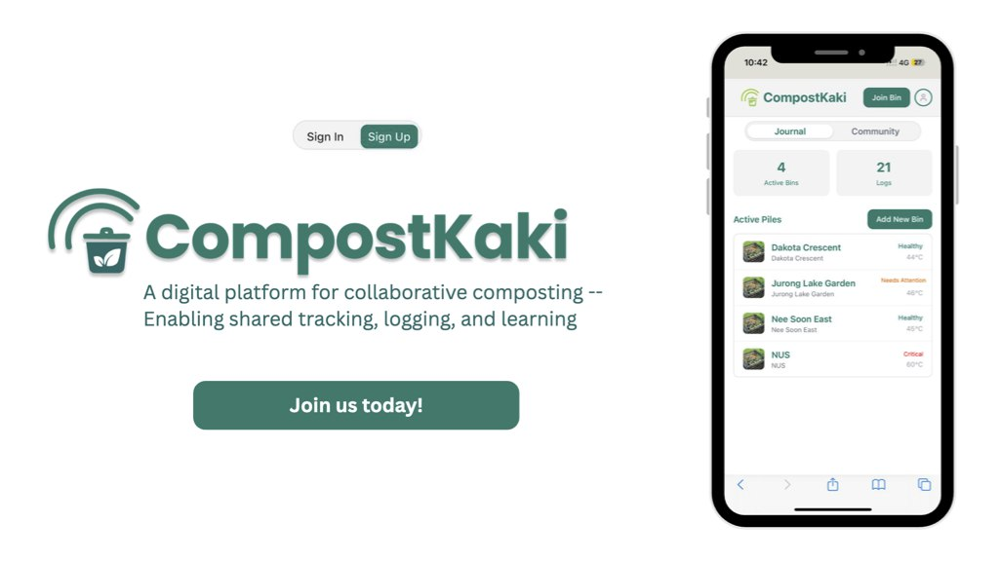

# CompostKaki 🌱

**A digital journaling platform that transforms composting into a collaborative, trackable effort — boosting community engagement and scaling food waste reduction islandwide.**

🌐 [Live Demo](https://compostkaki.vercel.app)  


---

## The Problem

In 2023, Singapore generated over **750,000 tonnes of food waste** — equivalent to 30,000 public buses. Yet, only **18%** of that waste was recycled.

Most of this organic matter ends up **incinerated or landfilled**, contributing to:
- **Methane emissions** from anaerobic decomposition
- **Toxic byproducts** from incineration
- Accelerated filling of Semakau Landfill which experts have predicted to be completely full by 2035 (in just 10 years' time from now!!!)

**Composting** is a much cleaner alternative, not only to food waste but also to contribute to a cause that most people overlook: The end-of-life of food journey. But **community composting efforts** often face:
- Lack of Manpower
- Inconsistent practices
- Improper handover system.

These issues are not just any issues, they are ones which leads to expensive failures, and projects being stalled or in stalemate. 

---

## Our Solution

**CompostKaki** is a platform that supports and **scales community composting** by transforming each compost pile into a shared digital project:

- **Log compost activities** — like turning, adding materials, or watering
- **Track pile health** — with temperature & moisture fields
- **Request help** — with food scraps, maintenance, or manpower
- **Create a shared timeline** — so no one works in the dark

By providing visibility, coordination, and collective ownership, CompostKaki makes composting easier and more sustainable at scale.

---

## Features

- Pre-defined action buttons: *Add Materials*, *Monitor*, *Turn Pile*, etc.
- Log material types (greens, browns, water)
- Input temperature & select moisture level
- Upload optional images with logs
- Status visibility: those who join the same bin would receive updates of activities and tasks for that bin
- Mobile-first UI with compost-themed visuals

---

## 🛠️ Tech Stack

| Layer        | Tech Used                         |
|--------------|----------------------------------|
| Frontend     | **Next.js 15**, Tailwind CSS     |
| Backend      | **Supabase** (Postgres, Auth, Storage) |
| UI           | Lucide Icons, Custom Components  |
| Deployment   | Vercel                           |

---

## Try It Yourself
🌐 [Live Demo](https://compostkaki.vercel.app)

---

## 📸 GIF Demo :>

### Joining Bin 


### Logging Activity


### Posting Task

Playthrough of posting a task, this task would be displayed to everyone who joins the same bin :) and they would be able to accept the task too 

---
## How to Run Locally

```bash
git clone https://github.com/magentaong/Composters.git
cd Composters
npm install

# Setup .env.local
NEXT_PUBLIC_SUPABASE_URL=your_supabase_url
NEXT_PUBLIC_SUPABASE_ANON_KEY=your_anon_key

npm run dev
```

## 💡 Future Plans

(TODO: Write future plans hahaha)

---

## 👥 Meet the Team

**Team CompostKaki** – Community Hackathon 2025  
Supported by **Mountbatten CIT** and collaborated with Nparks, Jurong Lakeside Garden.

| Name           | Role                 |
|----------------|----------------------|
| Meijuan        | Community Builder    |
| Swann          | Backend Engineer     |
| Magenta Ong    | Frontend Engineer    |
| Sumit          | Full-stack Developer |
| Si Hui (Ariel) | Product Manager      |

---

## 🏆 Built For

**Community Hackathon 2025**  
Organized by [Open Government Products](https://community-hackathon.gov.sg) in collaboration with [People's Association](https://www.pa.gov.sg/our-programmes/pa-sparks/)

---

## 📜 License

MIT, feel free to fork and remix with credit :) 


